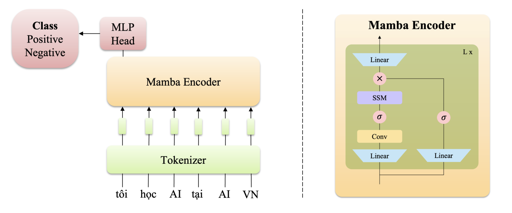
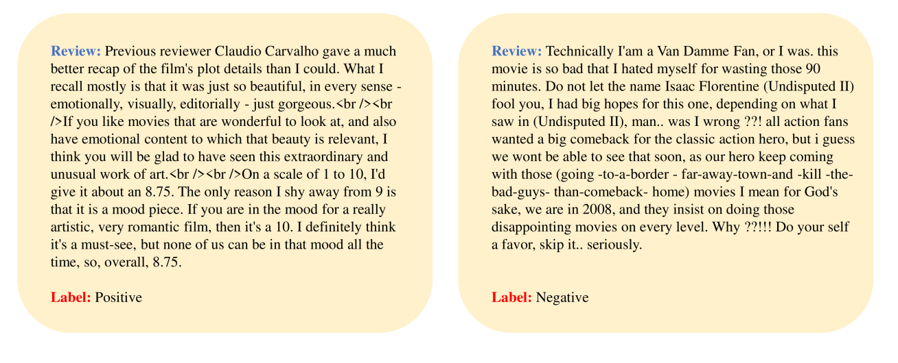
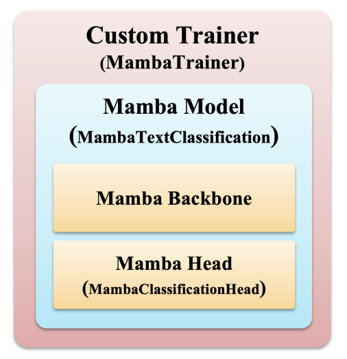

<h1>Text Classification with Mamba - Project</h1>

<h2>I. Introduction</h2>

    Recently, Mamba is a newly introduced architecture that has received strong support from the research community. Mamba has become a trend due to its superior capabilities compared to Transformer (the currently popular architecture). Its superiority is demonstrated in all three main criteria for evaluating a model: accuracy, speed, and computational cost.

  
  
<em>Figure 1: Overview of MAMBA Model</em>

    In this project, we will explore the basics of the Mamba architecture and apply Mamba to the text classification problem.

<h2>II. Implementation</h2>

<h3>1. Dataset IMDB</h3>

    The IMDB dataset consists of 50,000 movie reviews. It is used for classifying reviews as either negative or positive. The dataset is evenly split into two parts, with 25,000 samples for training and 25,000 samples for testing. Additionally, the dataset provides 50,000 unlabeled samples to support the training process. However, in this project, we will only use the labeled data to train the model.

  
  
<em>Figure 2: Illustrative example of the IMDB dataset.</em>

<h3>2. Build Custom Mamba Model</h3>

  

You can see it in <code>[solution]_Text_Cls_with_Mamba_Project.ipynb</code>

